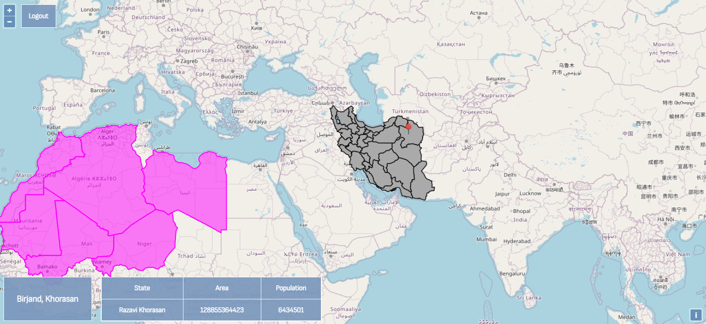

# 🗺️ Geo-Explorer

A university project for the **Semantic Web** course.  
Users can log in, explore maps, add markers by clicking, and fetch location data such as population from **DBpedia**. Maps and shapefiles are served via **GeoServer** and displayed using **OpenLayers** and **JavaScript**.

## 📦 How to Run
1. Set up the Django project and GeoServer with the provided shapefiles.  
2. Open the web application in your browser.  
3. Log in and interact with the map:
   - Click on locations to add markers.
   - Marker information is fetched from DBpedia and displayed in the table below the map.

This project was done in collaboration with [Amir Dehkordi](https://github.com/amir-dehkordi).

